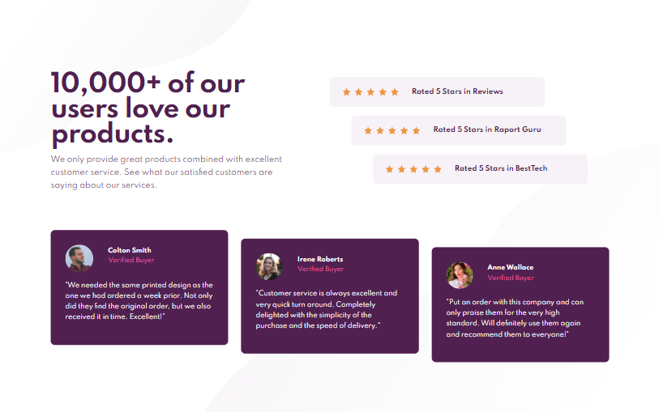
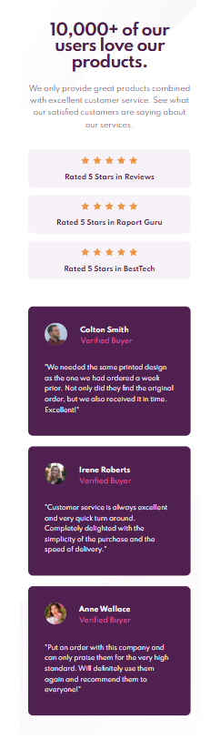

## Table of contents

- [Overview](#overview)
  - [Screenshot](#screenshot)
  - [Links](#links)
- [My process](#my-process)
  - [Built with](#built-with)

## Overview

This is a solution to the [Social proof section challenge on Frontend Mentor](https://www.frontendmentor.io/challenges/social-proof-section-6e0qTv_bA)

### Screenshot

### Links

- Live Site URL: (https://karbowskam.github.io/social-proof-section/)

## My process

### Built with

- Semantic HTML5
- BEM
- CSS Grid
- SASS
- Gulp
- Media queries